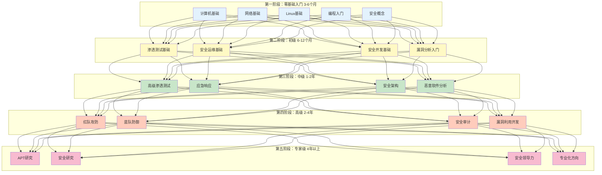

# 网络安全完整学习路径

> 从零基础到安全专家的系统化学习路线

## 📊 学习路径可视化

---

## 🌱 第一阶段：零基础入门（3-6个月）

### 学习目标
- 建立扎实的计算机基础知识
- 掌握网络通信原理
- 熟练使用Linux操作系统
- 掌握至少一门编程语言
- 理解网络安全基本概念

### 核心知识点

#### 1. 计算机基础
- 计算机组成原理
  - CPU、内存、硬盘工作原理
  - 二进制、十六进制表示
  - 数据存储与编码（ASCII、Unicode）
- 操作系统基础
  - 进程与线程
  - 内存管理
  - 文件系统
- 虚拟化技术
  - VMware/VirtualBox使用
  - 虚拟机网络配置

#### 2. 网络基础
- OSI七层模型与TCP/IP四层模型
- 常用协议详解
  - HTTP/HTTPS
  - DNS
  - TCP/UDP
  - ICMP
  - FTP/SSH
- 网络设备与配置
  - 路由器、交换机原理
  - IP地址、子网掩码、网关
  - NAT、DHCP
- 网络工具使用
  - Wireshark抓包分析
  - ping、traceroute、netstat
  - nmap基础扫描

#### 3. Linux基础
- Linux发行版选择（Ubuntu、Kali Linux）
- 命令行操作
  - 文件管理（ls、cd、cp、mv、rm）
  - 权限管理（chmod、chown）
  - 进程管理（ps、top、kill）
  - 网络配置（ifconfig、ip）
- Shell脚本编程
  - 变量、条件判断、循环
  - 函数与参数
- 包管理与软件安装
  - apt、yum、dpkg
- 服务管理
  - systemd
  - 服务启动、停止、开机自启

#### 4. 编程入门
选择一门语言深入学习（推荐Python）：

**Python（强烈推荐）**
- 基础语法
- 数据结构（列表、字典、集合）
- 文件操作
- 网络编程（requests、socket）
- 自动化脚本编写

**其他选择**
- C语言：理解底层原理
- JavaScript：Web安全必备
- Go：现代安全工具开发

#### 5. 安全概念入门
- 网络安全定义与范畴
- CIA三要素（机密性、完整性、可用性）
- 常见攻击类型
  - 病毒、木马、蠕虫
  - 钓鱼攻击、社会工程
  - DDoS攻击
- 常见防御措施
  - 防火墙、IDS/IPS
  - 杀毒软件、EDR
  - 加密技术
- 道德与法律
  - 授权测试的重要性
  - 相关法律法规
  - 职业道德准则

### 实践任务
- [ ] 搭建虚拟化实验环境
- [ ] 安装并熟练使用Linux（Ubuntu/Kali）
- [ ] 使用Wireshark抓取并分析网络流量
- [ ] 编写至少10个实用Python脚本
- [ ] 完成网络基础实验（子网划分、路由配置）
- [ ] 阅读《网络安全法》了解法律边界

### 推荐资源
- 书籍：《计算机网络：自顶向下方法》、《鸟哥的Linux私房菜》
- 在线课程：Coursera计算机网络、Linux基金会认证
- 实验平台：TryHackMe "Pre-Security"路径

### 阶段评估标准
- ✅ 能够独立搭建虚拟化实验环境
- ✅ 熟练使用Linux命令行完成日常操作
- ✅ 理解网络通信基本原理，能分析网络流量
- ✅ 能够编写简单的自动化脚本
- ✅ 建立网络安全整体认知框架

---

## 📗 第二阶段：初级（6-12个月）

### 学习目标
- 掌握渗透测试基本方法论
- 了解安全运维日常工作
- 具备安全编码意识
- 能够分析常见漏洞

### 核心知识点

#### 1. 渗透测试基础
- 渗透测试方法论
  - PTES标准
  - 渗透测试流程（信息收集→漏洞发现→漏洞利用→后渗透→报告）
- 信息收集技术
  - 被动信息收集（OSINT）
    - Google Hacking
    - WHOIS查询
    - Shodan、ZoomEye
  - 主动信息收集
    - 端口扫描（nmap）
    - 服务识别
    - 目录扫描
- Web渗透测试
  - OWASP Top 10漏洞
    - SQL注入
    - XSS跨站脚本
    - CSRF跨站请求伪造
    - 文件上传漏洞
    - 文件包含漏洞
  - 工具使用
    - Burp Suite
    - SQLMap
    - Nmap
- 密码攻击
  - 密码破解原理
  - Hydra、John the Ripper
  - 彩虹表攻击

#### 2. 安全运维基础
- 日志分析
  - Linux系统日志
  - Web服务器日志（Apache、Nginx）
  - 日志分析工具（ELK Stack）
- 安全监控
  - IDS/IPS原理与部署（Snort、Suricata）
  - SIEM基础
- 漏洞管理
  - 漏洞扫描工具（Nessus、OpenVAS）
  - 漏洞评分标准（CVSS）
  - 漏洞修复流程
- 安全加固
  - 操作系统加固
  - Web服务器加固
  - 数据库加固

#### 3. 安全开发基础
- 安全编码原则
  - 输入验证
  - 输出编码
  - 参数化查询
- 常见漏洞防范
  - SQL注入防护
  - XSS防护
  - CSRF防护
- 安全开发生命周期（SDLC）
- 代码审计基础
  - 静态代码分析
  - 常见代码审计工具

#### 4. 漏洞分析入门
- 漏洞分类与评级
- CVE、CNVD、NVD数据库使用
- 漏洞复现方法
  - 环境搭建
  - POC验证
- 漏洞报告编写
- 漏洞披露流程

### 实践任务
- [ ] 完成DVWA所有漏洞练习
- [ ] 使用Burp Suite完成Web渗透测试
- [ ] 搭建并使用ELK Stack分析日志
- [ ] 编写漏洞POC至少5个
- [ ] 完成TryHackMe "Complete Beginner"路径
- [ ] 在HackTheBox完成至少10台初级机器

### 推荐资源
- 书籍：《Web安全深度剖析》、《白帽子讲Web安全》
- 在线课程：PortSwigger Web Security Academy
- 实验平台：HackTheBox、TryHackMe、DVWA、sqli-labs

### 认证目标
- CompTIA Security+
- CEH (Certified Ethical Hacker)

### 阶段评估标准
- ✅ 能够独立完成Web应用渗透测试
- ✅ 熟练使用主流安全工具
- ✅ 能够分析和复现常见漏洞
- ✅ 具备安全运维基本能力
- ✅ 通过Security+或CEH认证

---

## 📘 第三阶段：中级（1-2年）

### 学习目标
- 掌握高级渗透测试技术
- 具备应急响应能力
- 理解安全架构设计
- 能够进行恶意软件分析

### 核心知识点

#### 1. 高级渗透测试
- 内网渗透
  - 域环境渗透
  - 内网信息收集
  - 横向移动技术
  - 权限提升（提权）
  - 凭据窃取与传递
- 后渗透技术
  - 权限维持
  - 流量隧道（端口转发、代理）
  - 数据窃取
- 社会工程学攻击
  - 钓鱼邮件制作
  - SET工具使用
  - 鱼叉式攻击
- 无线安全
  - WiFi破解
  - 中间人攻击
- 移动安全基础
  - Android应用逆向
  - iOS安全基础

#### 2. 应急响应
- 应急响应流程
  - 准备、识别、抑制、根除、恢复、总结
- 入侵检测与分析
  - 流量分析
  - 异常行为检测
  - 恶意文件分析
- 数字取证
  - 磁盘取证
  - 内存取证（Volatility）
  - 网络取证
- 事件处理
  - 日志分析技巧
  - 攻击溯源
  - 事件报告编写

#### 3. 安全架构
- 安全架构设计原则
  - 深度防御
  - 最小权限原则
  - 纵深防御
- 网络安全架构
  - 防火墙部署策略
  - DMZ设计
  - VPN架构
  - 零信任架构
- 应用安全架构
  - 身份认证与授权
  - 加密技术应用
  - 安全API设计
- 云安全架构
  - AWS/Azure/GCP安全
  - 容器安全（Docker、K8s）

#### 4. 恶意软件分析
- 静态分析
  - PE文件结构
  - 反编译与反汇编
  - 字符串提取、导入表分析
- 动态分析
  - 沙箱技术
  - 行为监控
  - 网络流量分析
- 逆向工程基础
  - 汇编语言基础
  - IDA Pro、Ghidra使用
  - 调试技术
- 高级分析技术
  - 反调试绕过
  - 反虚拟机技术
  - 加壳与脱壳

### 实践任务
- [ ] 完成HackTheBox中级机器至少30台
- [ ] 搭建AD域环境并完成域渗透
- [ ] 完成一次完整的应急响应演练
- [ ] 分析至少10个恶意样本
- [ ] 参加CTF比赛并进入前50%
- [ ] 编写自己的渗透测试工具

### 推荐资源
- 书籍：《内网安全攻防》、《恶意代码分析实战》、《逆向工程核心原理》
- 在线课程：SANS SEC560、SEC504
- 实验平台：HackTheBox、VulnHub、Any.Run

### 认证目标
- OSCP (Offensive Security Certified Professional) ⭐
- CISM (Certified Information Security Manager)
- GCIH (GIAC Certified Incident Handler)

### 阶段评估标准
- ✅ 独立完成内网渗透测试项目
- ✅ 能够处理真实安全事件
- ✅ 设计企业级安全架构
- ✅ 具备恶意软件分析能力
- ✅ 通过OSCP认证

---

## 📕 第四阶段：高级（2-4年）

### 学习目标
- 具备红蓝对抗能力
- 掌握安全审计方法
- 能够开发漏洞利用代码
- 形成专业领域特长

### 核心知识点

#### 1. 红队攻防
- 红队方法论
  - TIBER-EU框架
  - ATT&CK框架应用
- 高级攻击技术
  - APT模拟攻击
  - 供应链攻击
  - 物理安全测试
  - 社会工程高级技巧
- 规避检测技术
  - EDR绕过
  - 沙箱逃逸
  - 流量伪装
- 红队工具开发
  - C2框架开发
  - 自定义攻击工具
  - 自动化攻击平台

#### 2. 蓝队防御
- 威胁狩猎
  - 威胁情报应用
  - 行为分析
  - 异常检测
- 安全运营中心（SOC）建设
  - SIEM高级应用
  - SOAR自动化编排
  - 安全编排与响应
- 高级防御技术
  - EDR/XDR部署与优化
  - UEBA用户行为分析
  - 零信任实施
- 蓝队演练
  - 紫队协作
  - 防御有效性验证

#### 3. 安全审计
- 安全审计框架
  - ISO 27001
  - NIST网络安全框架
  - 等保2.0
- 渗透测试审计
  - 测试范围与方法
  - 结果验证
  - 风险评估
- 合规审计
  - 数据保护法规（GDPR、个人信息保护法）
  - 行业合规要求（PCI DSS、HIPAA）
- 审计报告编写
  - 发现描述
  - 风险评级
  - 修复建议

#### 4. 漏洞利用开发
- 漏洞研究方法
  - 补丁对比
  - Fuzzing技术
  - 代码审计高级技巧
- 漏洞利用开发
  - 栈溢出利用
  - 堆溢出利用
  - 内核漏洞利用
  - 浏览器漏洞利用
- 高级利用技术
  - ROP链构造
  - Shellcode编写
  - 绕过防护机制（ASLR、DEP）
- 漏洞披露
  - 负责任披露
  - 漏洞交易平台

### 实践任务
- [ ] 参与真实红蓝对抗演练
- [ ] 挖掘并提交0day漏洞
- [ ] 开发完整的漏洞利用代码
- [ ] 主导企业安全审计项目
- [ ] 在安全会议发表演讲或技术文章
- [ ] 获得OSCP或其他高级认证

### 推荐资源
- 书籍：《红队实战宝典》、《漏洞战争》、《灰帽黑客》
- 在线课程：SANS SEC660、SEC760
- 实验平台：PWNable.kr、Exploit-DB

### 认证目标
- CISSP (Certified Information Systems Security Professional)
- CISA (Certified Information Systems Auditor)
- OSWE (Offensive Security Web Expert)

### 阶段评估标准
- ✅ 独立规划和执行红队项目
- ✅ 主导企业级安全审计
- ✅ 挖掘高质量漏洞
- ✅ 在安全领域有一定影响力
- ✅ 通过CISSP认证

---

## 🔮 第五阶段：专家级（4年以上）

### 学习目标
- 成为安全领域权威专家
- 具备独立研究能力
- 培养安全领导力
- 引领行业发展方向

### 核心知识点

#### 1. APT研究
- APT组织追踪
  - 威胁情报分析
  - 攻击归因
  - TTPs提取
- 高级攻击手法研究
  - 供应链攻击
  - 针对性攻击
  - 长期潜伏技术
- 国家级安全
  - 关键基础设施保护
  - 国家安全战略
  - 网络战研究

#### 2. 安全研究
- 前沿技术研究
  - AI安全
  - 区块链安全
  - 物联网安全
  - 量子计算安全
- 漏洞研究
  - 高价值漏洞挖掘
  - 新型攻击技术
  - 防御技术创新
- 学术研究
  - 论文发表
  - 专利申请
  - 标准制定

#### 3. 安全领导力
- 团队管理
  - 安全团队建设
  - 人才培养
  - 绩效管理
- 战略规划
  - 企业安全战略
  - 预算管理
  - 供应商管理
- 风险管理
  - 企业风险管理
  - 业务连续性
  - 危机管理
- 沟通与影响力
  - 董事会汇报
  - 跨部门协作
  - 行业影响力建设

#### 4. 专业化方向
选择一个或多个方向深入研究：

**方向一：安全架构师**
- 企业安全架构设计
- 安全产品选型与集成
- 安全体系建设

**方向二：安全研究员**
- 漏洞挖掘与披露
- 安全工具开发
- 学术研究

**方向三：首席信息安全官（CISO）**
- 安全战略规划
- 合规管理
- 团队领导

**方向四：安全顾问**
- 安全咨询
- 风险评估
- 培训教育

### 实践任务
- [ ] 主导大型企业安全项目
- [ ] 发表高质量研究论文或技术文章
- [ ] 在顶级安全会议演讲（BlackHat、DEF CON）
- [ ] 培养安全团队人才
- [ ] 参与行业标准或法规制定
- [ ] 成为某个细分领域的权威

### 推荐资源
- 书籍：《企业安全建设指南》、《CISO领导力》
- 会议：BlackHat、DEF CON、RSA Conference、CanSecWest
- 社区：Security research groups、学术期刊

### 认证目标
- OSEE (Offensive Security Exploit Expert)
- GXPN (GIAC Exploit Researcher and Advanced Penetration Tester)
- CISSP专项认证（ISSAP、ISSEP、ISSMP）

### 阶段评估标准
- ✅ 在安全领域具有行业影响力
- ✅ 持续产出高质量研究成果
- ✅ 能够领导大型安全项目或团队
- ✅ 成为细分领域权威专家
- ✅ 为行业发展做出贡献

---

## 🎯 四大专业方向学习路径

除了阶段式的学习路径，你也可以根据自己的兴趣和职业规划，选择以下四个专业方向之一进行深入：

### 方向一：渗透测试与攻防（红队方向）

**适合人群**：喜欢攻击性安全、技术挑战性强的工作

**学习重点**：
- Web渗透 → 内网渗透 → 红队攻防
- 工具使用 → 工具开发 → 框架开发
- 漏洞利用 → 漏洞挖掘 → 0day研究

**认证路径**：CEH → OSCP → OSWE → OSEE

**职业发展**：渗透测试工程师 → 高级渗透测试工程师 → 红队负责人 → 安全研究员

### 方向二：安全运维与防御（蓝队方向）

**适合人群**：喜欢防御性安全、保障业务稳定运行

**学习重点**：
- 日志分析 → 安全监控 → 威胁狩猎
- 应急响应 → 事件处理 → 取证分析
- 安全加固 → 安全架构 → 安全运营

**认证路径**：Security+ → GCIH → GCIA → GREM

**职业发展**：安全运维工程师 → SOC分析师 → 安全运营经理 → CSO

### 方向三：安全开发与代码审计

**适合人群**：有开发背景、喜欢代码层面安全

**学习重点**：
- 安全编码 → 代码审计 → 安全架构
- DevSecOps → 安全工具开发 → 自动化平台
- 应用安全 → 云安全 → 安全产品研发

**认证路径**：Security+ → CSSLP → OSWE

**职业发展**：安全开发工程师 → 安全架构师 → 安全研发负责人 → 安全产品总监

### 方向四：安全研究与漏洞分析

**适合人群**：热爱技术研究、喜欢攻克难题

**学习重点**：
- 逆向工程 → 漏洞挖掘 → 漏洞利用
- 恶意软件分析 → APT研究 → 威胁情报
- 二进制安全 → 内核安全 → 硬件安全

**认证路径**：GREM → GXPN → OSEE

**职业发展**：安全研究员 → 高级研究员 → 实验室负责人 → 首席科学家

---

## 💡 学习建议

### 时间分配原则

| 学习阶段 | 理论学习 | 实践练习 | 项目实战 | 认证准备 |
|---------|---------|---------|---------|---------|
| 零基础入门 | 40% | 40% | 10% | 10% |
| 初级阶段 | 30% | 40% | 20% | 10% |
| 中级阶段 | 20% | 30% | 40% | 10% |
| 高级阶段 | 10% | 20% | 50% | 20% |
| 专家级 | 10% | 20% | 60% | 10% |

### 学习方法建议

1. **理论实践结合**：学一个知识点，立即动手验证
2. **项目驱动学习**：通过实际项目带动技能提升
3. **记录总结**：建立个人知识库和技术博客
4. **社区参与**：加入安全社区，与他人交流学习
5. **持续迭代**：定期回顾，深化理解

### 常见问题

**Q: 零基础可以直接学渗透测试吗？**
A: 不建议。网络安全需要扎实的计算机、网络、编程基础。跳过基础直接学渗透测试会走很多弯路。

**Q: 需要学习多门编程语言吗？**
A: 初期精通一门即可（推荐Python），后期根据需要扩展。安全研究员通常需要掌握C/C++、汇编。

**Q: 认证考试重要吗？**
A: 认证是能力的证明，但不是最终目标。建议以技能为核心，认证为辅助。OSCP等实战型认证含金量较高。

**Q: 如何平衡工作和学习？**
A: 制定长期计划，每天保持1-2小时学习，周末投入更多时间。利用碎片时间听课程、看文章。

**Q: 多久能达到专家级？**
A: 这取决于个人投入、学习方法和天赋。通常需要5-10年的持续学习和实践。专家级不仅看技术水平，还要看行业影响力。

---

## 📝 总结

网络安全是一个终身学习的领域，技术在不断演进，攻击手法层出不穷。本学习路径提供了一个系统化的框架，但最重要的还是：

- **持续学习**：保持好奇心和学习热情
- **大量实践**：纸上得来终觉浅
- **社区交流**：与同行交流，碰撞思想
- **道德为先**：技术要有边界，始终遵守法律和职业道德

祝你学习顺利，早日成为网络安全专家！🚀
