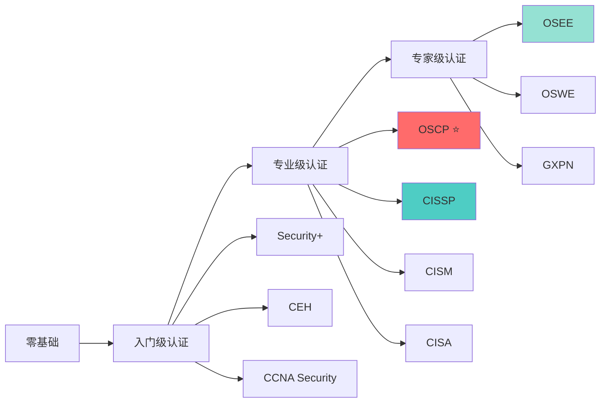

# 认证考试路径

> 主流网络安全认证考试指南，规划你的认证学习路线

## 🎯 为什么需要认证

虽然认证不是能力的唯一证明，但它有以下价值：

- ✅ **系统化学习**：认证课程提供系统的知识体系
- ✅ **能力证明**：向雇主证明你的专业能力
- ✅ **职业发展**：许多职位要求或优先考虑认证持有者
- ✅ **薪资提升**：认证通常与更高薪资挂钩
- ✅ **行业认可**：获得行业和社区的认可

## 📊 认证路线图



## 📚 认证分类

### [入门级认证](./entry-level/)

适合零基础和初学者，建立安全知识体系：

- **CompTIA Security+** - 安全入门金标准
- **CEH** - 道德黑客认证
- **CCNA Security** - Cisco安全认证

### [专业级认证](./professional/)

适合有经验的从业者，专业能力认证：

- **OSCP** - 渗透测试实战认证 ⭐ 强烈推荐
- **CISSP** - 信息系统安全专家
- **CISM** - 信息安全经理
- **CISA** - 信息系统审计师

### [专家级认证](./expert/)

适合高级安全专家，顶尖能力认证：

- **OSEE** - 高级利用开发专家
- **OSWE** - Web安全专家
- **GXPN** - 高级漏洞研究专家

## 🎯 认证选择建议

### 根据职业方向选择

#### 渗透测试方向
```
Security+ → CEH → OSCP → OSEE/OSWE
```

#### 安全管理方向
```
Security+ → CISM → CISSP
```

#### 安全审计方向
```
Security+ → CISA → CISSP
```

#### 安全研究方向
```
Security+ → OSCP → GXPN → OSEE
```

### 根据经验水平选择

| 经验水平 | 推荐认证 | 学习时间 |
|---------|---------|---------|
| 零基础 | Security+、CCNA Security | 3-6个月 |
| 1-2年经验 | CEH、Security+ | 3-6个月 |
| 2-4年经验 | OSCP、CISM | 6-12个月 |
| 4年以上 | CISSP、CISA | 6-12个月 |
| 高级专家 | OSEE、GXPN | 12个月+ |

## 💰 认证成本对比

| 认证 | 考试费用 | 学习资料 | 培训课程 | 总成本估算 |
|------|---------|---------|---------|-----------|
| Security+ | $370 | $50-100 | $500-2000 | $1000-2500 |
| CEH | $1199 | $100-200 | $2000-4000 | $3300-5400 |
| OSCP | $999 | 包含 | 包含 | $999-1649 |
| CISSP | $749 | $100-200 | $3000-5000 | $3850-5950 |
| CISM | $760 | $100-200 | $2000-4000 | $2860-4960 |

> 注：费用为2024年参考价格，具体以官方为准

## 📈 认证薪资对比（美国）

| 认证 | 平均年薪 | 薪资范围 |
|------|---------|---------|
| Security+ | $85,000 | $65,000 - $110,000 |
| CEH | $95,000 | $75,000 - $125,000 |
| OSCP | $110,000 | $85,000 - $140,000 |
| CISSP | $125,000 | $100,000 - $160,000 |
| CISM | $130,000 | $105,000 - $165,000 |

> 数据来源：PayScale、Glassdoor

## 🎓 认证学习建议

### 通用建议

1. **先实践后认证**
   - 通过实践掌握技能
   - 认证是验证能力，不是获取能力

2. **不要贪多**
   - 专注于一两个核心认证
   - 深度胜过广度

3. **实战导向**
   - 优先选择实战型认证（如OSCP）
   - 纸面认证含金量较低

4. **持续学习**
   - 认证需要续证
   - 保持学习和技术更新

### 认证价值排序

**实战型认证（高价值）**：
1. OSCP ⭐⭐⭐⭐⭐
2. OSWE ⭐⭐⭐⭐⭐
3. OSEE ⭐⭐⭐⭐⭐

**知识型认证（中高价值）**：
1. CISSP ⭐⭐⭐⭐
2. CISM ⭐⭐⭐⭐
3. CISA ⭐⭐⭐⭐

**入门型认证（中等价值）**：
1. Security+ ⭐⭐⭐
2. CEH ⭐⭐⭐

## 📅 认证规划时间线

### 零基础路径（18-24个月）

```
Month 1-6:   完成Security+学习和考试
Month 7-12:  积累经验，准备CEH
Month 13-18: 完成CEH学习和考试
Month 19-24: 准备OSCP（可选）
```

### 有经验路径（12-18个月）

```
Month 1-6:   根据方向选择入门认证
Month 7-12:  准备专业级认证（OSCP或CISSP）
Month 13-18: 获得认证并续证
```

## 🔗 相关资源

- [学习路径](../00-roadmap/learning-path.md) - 技能学习
- [学习资源](../08-resources/) - 书籍、课程
- [实验环境](../07-labs/) - 实践练习

---

**认证是能力的证明，但能力才是核心！** 🎯

建议：先通过实践掌握技能，再通过认证验证能力。
