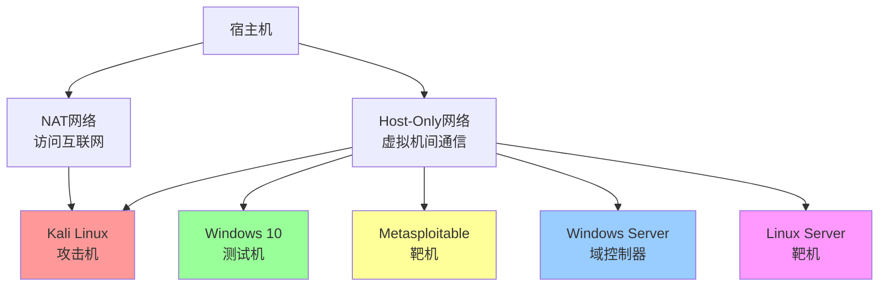

# 实验环境搭建指南

> 从零开始搭建你的网络安全学习实验室，支持渗透测试、恶意软件分析、安全运维等多种学习场景

## 📋 前置要求

### 硬件要求

| 实验类型 | CPU | 内存 | 硬盘 | 网络 |
|---------|-----|------|------|------|
| 基础学习 | 4核心 | 8GB | 100GB可用空间 | 宽带网络 |
| 渗透测试实验室 | 4-8核心 | 16GB | 200GB可用空间 | 宽带网络 |
| 恶意软件分析 | 4-8核心 | 16-32GB | 200GB+SSD | 隔离网络 |
| 完整安全实验室 | 8核心+ | 32GB+ | 500GB+ | 隔离网络 |

### 软件要求

- **操作系统**：Windows 10/11、Linux或macOS
- **虚拟化软件**：VMware Workstation、VirtualBox或Hyper-V
- **其他**：足够的磁盘空间存储虚拟机文件

### 时间要求

- 基础环境搭建：2-3小时
- 完整实验室搭建：1-2天
- 环境调试和优化：额外2-4小时

## 🎯 环境规划

### 网络架构设计



### 虚拟机规划

| 虚拟机名称 | 操作系统 | 内存 | CPU | 硬盘 | 网络模式 | 用途 |
|-----------|---------|------|-----|------|---------|------|
| Kali Linux | Kali 2023.x | 4GB | 2核心 | 50GB | NAT + Host-Only | 攻击机/工具平台 |
| Windows 10 | Win10 21H2 | 4GB | 2核心 | 60GB | Host-Only | 测试机/靶机 |
| Metasploitable | Linux | 1GB | 1核心 | 10GB | Host-Only | 漏洞靶机 |
| Windows Server | Server 2019 | 4GB | 2核心 | 40GB | Host-Only | 域环境靶机 |
| DVWA | Linux | 1GB | 1核心 | 10GB | Host-Only | Web靶机 |

## 🚀 分步搭建指南

### 第一步：安装虚拟化软件

#### 选项A：VMware Workstation（推荐）

**优点**：性能好、功能强大、兼容性好  
**缺点**：付费软件（有试用版）

**安装步骤**：

1. 下载 VMware Workstation Pro
   - 官网：https://www.vmware.com/products/workstation-pro.html
   - 试用版可免费使用30天

2. 安装步骤：
   ```
   - 双击安装文件
   - 选择安装路径（建议安装在SSD）
   - 完成安装并重启计算机
   ```

3. 配置网络编辑器：
   - 打开"编辑" → "虚拟网络编辑器"
   - 配置VMnet1（Host-Only）：192.168.x.0/24
   - 配置VMnet8（NAT）：自动分配
   - 点击"更改设置"获取管理员权限

#### 选项B：VirtualBox（免费）

**优点**：免费开源、跨平台  
**缺点**：性能略逊于VMware

**安装步骤**：

1. 下载 VirtualBox
   - 官网：https://www.virtualbox.org/wiki/Downloads

2. 安装步骤：
   ```
   - 运行安装程序
   - 安装网络驱动（会临时断网）
   - 完成安装
   ```

3. 安装扩展包：
   - 下载 Extension Pack
   - 打开 VirtualBox → "管理" → "全局设定" → "扩展"
   - 点击添加扩展包

#### 选项C：Hyper-V（Windows专业版）

**优点**：Windows原生、性能好  
**缺点**：功能相对简单

**启用步骤**：

1. 打开"控制面板" → "程序" → "启用或关闭Windows功能"
2. 勾选"Hyper-V"
3. 重启计算机

### 第二步：创建Kali Linux虚拟机

#### 下载Kali镜像

1. 访问官网：https://www.kali.org/get-kali/
2. 选择"Kali Linux VMware 64-Bit"（预装VMware Tools）
3. 或下载ISO镜像手动安装

#### 创建虚拟机（VMware）

```bash
# 方法一：导入预构建镜像（推荐）
1. 解压下载的Kali VMware镜像
2. 打开VMware，选择"打开虚拟机"
3. 选择解压后的.vmx文件
4. 调整虚拟机配置（内存、CPU）
5. 启动虚拟机

# 默认账号：kali / kali
```

```bash
# 方法二：手动安装
1. 创建新虚拟机
2. 选择"典型配置"
3. 选择ISO镜像文件
4. 设置虚拟机名称和位置
5. 分配内存：建议4GB
6. 分配CPU：建议2核心
7. 硬盘：建议50GB
8. 自定义硬件：
   - 网络：NAT + Host-Only
   - 显卡：自动
9. 启动虚拟机并安装系统
```

#### Kali初始配置

```bash
# 更新系统
sudo apt update && sudo apt upgrade -y

# 安装常用工具（如果没有）
sudo apt install -y git curl wget vim

# 配置中文环境（可选）
sudo apt install -y locales
sudo dpkg-reconfigure locales
# 选择 zh_CN.UTF-8

# 设置时区
sudo timedatectl set-timezone Asia/Shanghai

# 创建快照
# VMware: 虚拟机 → 快照 → 拍摄快照
# 命名：Kali-Base-$(date +%Y%m%d)
```

#### Kali网络配置

```bash
# 查看网络接口
ip addr

# 配置静态IP（Host-Only网卡）
sudo vim /etc/network/interfaces

# 添加以下内容（根据实际情况调整）
auto eth1
iface eth1 inet static
    address 192.168.xxx.100
    netmask 255.255.255.0

# 重启网络服务
sudo systemctl restart networking

# 测试网络
ping 192.168.xxx.1  # 宿主机IP
```

### 第三步：创建Windows虚拟机

#### 下载Windows镜像

1. **Windows 10**
   - 官网：https://www.microsoft.com/software-download/windows10
   - 选择"下载工具现在"获取ISO

2. **Windows Server 2019**
   - 官网：https://www.microsoft.com/evalcenter/evaluate-windows-server-2019
   - 选择ISO下载

#### 创建虚拟机

```bash
# VMware创建步骤
1. 创建新虚拟机
2. 选择Windows 10 x64
3. 分配资源：
   - 内存：4GB
   - CPU：2核心
   - 硬盘：60GB
4. 自定义硬件：
   - 网络：Host-Only
5. 启动并安装系统
```

#### Windows初始配置

```powershell
# 关闭防火墙（仅限实验环境）
netsh advfirewall set allprofiles state off

# 启用远程桌面
系统属性 → 远程 → 允许远程连接

# 创建测试用户
net user test Test@123 /add
net localgroup administrators test /add

# 安装常用软件
# - Notepad++
# - 7-Zip
# - Chrome/Firefox
# - Python
# - Git

# 创建快照
# VMware: 虚拟机 → 快照 → 拍摄快照
# 命名：Win10-Base-$(date)
```

### 第四步：部署漏洞靶机

#### 部署Metasploitable

```bash
# 1. 下载Metasploitable
# 官网：https://sourceforge.net/projects/metasploitable/

# 2. 解压镜像文件

# 3. 在VMware中打开
- 打开虚拟机
- 选择 Metasploitable.vmx
- 配置网络：Host-Only
- 启动虚拟机

# 4. 登录信息
用户名：msfadmin
密码：msfadmin

# 5. 验证服务
# 访问 http://192.168.xxx.xxx
# 查看开放的端口和服务
```

#### 部署DVWA

```bash
# 方法一：在现有Linux虚拟机中部署
git clone https://github.com/digininja/DVWA.git
cd DVWA
# 配置PHP和MySQL
# 详细步骤见：lab-setup/basic-environment.md

# 方法二：使用Docker部署（推荐）
docker run --rm -it -p 80:80 vulnerables/web-dvwa

# 访问：http://localhost
# 默认账号：admin / password
```

### 第五步：配置网络和快照

#### 网络配置

```bash
# 查看虚拟网络配置
# VMware: 编辑 → 虚拟网络编辑器

# 建议配置
VMnet0 (桥接)：连接到物理网络
VMnet1 (Host-Only)：192.168.10.0/24  # 内部实验网络
VMnet8 (NAT)：10.0.0.0/24            # 访问互联网

# IP地址规划
Kali Linux：192.168.10.100
Windows 10：192.168.10.101
Metasploitable：192.168.10.102
Windows Server：192.168.10.103
```

#### 快照策略

```bash
# 基础快照（必须）
- Kali-Base-$(date)         # Kali安装完成后
- Win10-Base-$(date)        # Windows安装完成后
- Labs-Base-$(date)         # 所有虚拟机配置完成后

# 实验快照（按需）
- Before-Exploit-$(date)    # 攻击前快照
- After-Exploit-$(date)     # 攻击后快照

# 快照管理建议
- 定期清理不需要的快照
- 快照命名包含日期和描述
- 重要快照添加描述说明
```

## 🔧 高级配置

### 配置域环境（中级/高级）

```bash
# 1. 安装Windows Server
# 2. 配置Active Directory
# 3. 加入域的客户端

# 详细步骤见：lab-setup/penetration-testing-lab.md
```

### 配置安全监控（中级/高级）

```bash
# 部署ELK Stack
# 安装Snort/Suricata
# 配置SIEM

# 详细步骤见：lab-setup/security-monitoring-lab.md
```

### 配置恶意软件分析环境（高级）

```bash
# 使用Flare VM
# 配置REMnux
# 部署Cuckoo Sandbox

# 详细步骤见：lab-setup/malware-analysis-lab.md
```

## 🛠️ 常用工具配置

### Kali Linux工具配置

```bash
# 更新工具
sudo apt update
sudo apt upgrade

# 常用工具验证
nmap --version
metasploit-framework
burpsuite
sqlmap --version
gobuster
john --list=formats

# 安装额外工具
sudo apt install -y \
  bloodhound \
  crackmapexec \
  enum4linux \
  impacket-scripts \
  powershell \
  proxychains4

# 配置代理链（可选）
sudo vim /etc/proxychains4.conf
```

### Windows工具配置

```powershell
# 使用Chocolatey包管理器
Set-ExecutionPolicy Bypass -Scope Process -Force
iex ((New-Object System.Net.WebClient).DownloadString('https://chocolatey.org/install.ps1'))

# 安装常用工具
choco install -y notepadplusplus
choco install -y 7zip
choco install -y git
choco install -y python
choco install -y sysinternals
choco install -y wireshark
```

## 📊 环境验证清单

### 基础连通性测试

```bash
# 在Kali中测试
ping 192.168.10.101  # Windows 10
ping 192.168.10.102  # Metasploitable

# 端口扫描测试
nmap -sV 192.168.10.102

# Web访问测试
curl http://192.168.10.102
```

### 工具功能测试

```bash
# Nmap扫描
nmap -A 192.168.10.0/24

# Metasploit测试
msfconsole
msf6 > use auxiliary/scanner/portscan/tcp

# Burp Suite测试
# 打开Burp Suite，配置代理
# 访问测试网站验证拦截功能
```

### 快照恢复测试

```bash
# 1. 创建测试快照
# 2. 做一些修改
# 3. 恢复快照
# 4. 验证恢复成功
```

## 💡 最佳实践

### 环境管理

1. **定期备份**
   - 每周备份重要虚拟机
   - 使用外部硬盘或NAS存储
   - 保留多个版本的备份

2. **资源优化**
   - 关闭不使用的虚拟机
   - 调整虚拟机内存分配
   - 定期清理快照

3. **安全隔离**
   - 实验网络与生产网络隔离
   - 定期检查网络配置
   - 不在实验环境存储真实数据

### 学习流程

1. **实验前**
   - 创建快照
   - 明确实验目标
   - 准备必要工具

2. **实验中**
   - 记录操作步骤
   - 截图关键信息
   - 遇到问题及时记录

3. **实验后**
   - 恢复快照（如需要）
   - 整理实验笔记
   - 总结学习收获

## ❓ 常见问题

### Q1: 虚拟机无法启动？

**解决方案**：
- 检查BIOS虚拟化设置（VT-x/AMD-V）
- 检查Hyper-V冲突（如使用VMware）
- 查看虚拟机日志文件

### Q2: 网络不通？

**解决方案**：
- 检查虚拟网络编辑器配置
- 确认虚拟机网络适配器设置
- 检查防火墙规则
- 使用ping逐步排查

### Q3: 性能卡顿？

**解决方案**：
- 增加虚拟机内存和CPU
- 将虚拟机文件放在SSD
- 关闭虚拟机不必要的功能
- 优化宿主机性能

### Q4: 快照占用空间太大？

**解决方案**：
- 定期删除不需要的快照
- 只保留关键节点的快照
- 考虑使用完整克隆而非快照

## 🔗 相关文档

- [基础环境搭建详细指南](./basic-environment.md)
- [渗透测试实验室搭建](./penetration-testing-lab.md)
- [恶意软件分析环境搭建](./malware-analysis-lab.md)

---

**环境搭建是学习网络安全的第一步，投入时间搭建好环境，将受益整个学习过程！** 🚀
