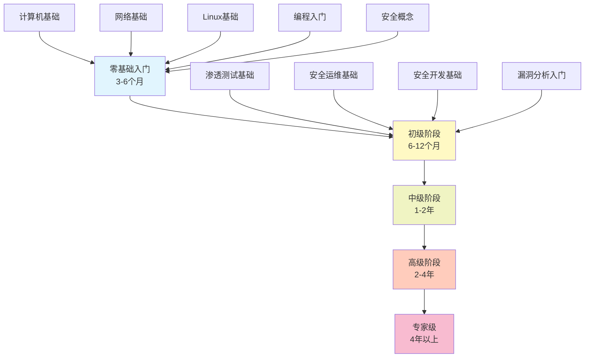
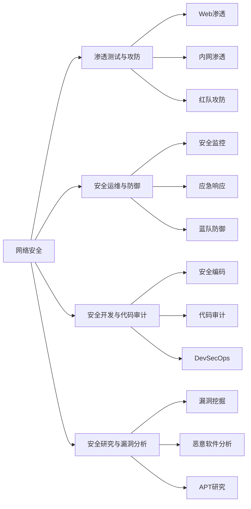

# 网络安全学习路线图 🛡️

> 从零基础到安全专家的完整学习路径，涵盖渗透测试、安全运维、安全开发、漏洞研究四大方向

## 📋 项目简介

这是一个系统化的网络安全学习资源库，为个人自学设计的完整学习路径。无论你是零基础小白还是想要进阶的安全从业者，都能在这里找到适合的学习内容。

## 🎯 学习路径概览



## 📚 目录结构

### 🗺️ 学习路线
- **[00-roadmap](./00-roadmap/)** - 学习路线总览和技能矩阵

### 📖 分阶段学习内容

| 阶段 | 目录 | 时长 | 适合人群 |
|------|------|------|----------|
| 🌱 零基础入门 | [01-foundation](./01-foundation/) | 3-6个月 | 完全零基础、转行人员 |
| 📗 初级阶段 | [02-junior](./02-junior/) | 6-12个月 | 有基础的入门者 |
| 📘 中级阶段 | [03-intermediate](./03-intermediate/) | 1-2年 | 安全从业者 |
| 📕 高级阶段 | [04-senior](./04-senior/) | 2-4年 | 资深安全工程师 |
| 🔮 专家级 | [05-expert](./05-expert/) | 4年以上 | 安全专家、研究员 |

### 🎓 认证考试路径

**[06-certifications](./06-certifications/)** - 主流安全认证考试指南

#### 入门级认证
- **CompTIA Security+** - 安全入门金标准
- **CEH** - 道德黑客认证
- **CCNA Security** - Cisco安全认证

#### 专业级认证
- **OSCP** - 渗透测试实战认证 ⭐
- **CISSP** - 信息系统安全专家
- **CISM** - 信息安全经理
- **CISA** - 信息系统审计师

#### 专家级认证
- **OSEE** - 高级利用开发专家
- **GXPN** - 高级漏洞研究专家

### 🧪 实验环境与实战

- **[07-labs](./07-labs/)** - 实验环境搭建和靶场推荐
  - **Docker 一键实验环境** ⭐ 推荐（[labs/docker-lab](./labs/docker-lab/)）
    - 包含 DVWA、SQLi Labs、bWAPP、WebGoat 等多个漏洞靶机
    - Kali Linux 工具容器、OWASP ZAP、Nuclei 扫描器
    - 一键启动，快速上手，边练边学
  - 本地实验环境搭建指南
  - 漏洞靶机推荐（DVWA、Metasploitable等）
  - CTF平台推荐（HackTheBox、TryHackMe等）
  - 云端实验室

- **[09-projects](./09-projects/)** - 实战项目案例
  - 初级项目：Web渗透、日志分析
  - 中级项目：红蓝对抗、应急响应
  - 高级项目：APT模拟、漏洞挖掘

### 📦 学习资源

**[08-resources](./08-resources/)** - 全面学习资源库
- 📚 书籍推荐（分阶段、分方向）
- 🎥 在线课程（免费+付费）
- 🛠️ 工具清单（分类整理）
- 👥 社区资源（论坛、博客、公众号）
- 🎤 会议演讲（BlackHat、DEF CON等）

### ✅ 进度追踪

**[10-checklists](./10-checklists/)** - 学习进度管理
- 技能检查清单
- 阶段评估标准
- 实践任务清单

## 🚀 快速开始

### 第一步：评估当前水平

查看 **[技能矩阵](./00-roadmap/skill-matrix.md)**，评估你当前的技能水平，确定应该从哪个阶段开始。

### 第二步：搭建实验环境

**推荐方案：Docker 一键环境** ⚡

```bash
# 克隆或下载项目后，进入 Docker 实验环境
cd labs/docker-lab

# Windows: 双击 start.bat
# Linux/Mac: ./start.sh
```

**详细指南：**
- 🚀 [Docker 快速开始](./labs/docker-lab/) - 最快 5 分钟启动完整环境
- 📖 [虚拟机环境搭建](./07-labs/lab-setup/) - 传统虚拟机方案

> 💡 **建议**：边学边练是最有效的学习方式！即使零基础，也建议先搭建好基础环境。

### 第三步：开始学习

根据你的起点，进入对应阶段的学习：

- **零基础** → [01-foundation](./01-foundation/)
- **有一定基础** → [02-junior](./02-junior/)
- **从业者** → [03-intermediate](./03-intermediate/)

### 第四步：实践验证

完成每个阶段后，通过 **[实战项目](./09-projects/)** 和 **[技能检查清单](./10-checklists/)** 验证学习成果。

## 🎯 四大专业方向

本学习路径覆盖网络安全的四大核心方向，你可以根据自己的兴趣和职业规划选择深耕：



## 📈 学习建议

### 时间规划

- **每天至少1-2小时** 的学习时间
- **理论与实践结合**，建议比例 3:7
- **每周完成一个小项目** 或实验
- **每月进行一次阶段性总结**

### 学习方法

1. **理论先行**：理解核心概念和原理
2. **动手实践**：在实验环境中验证理论
3. **总结归纳**：记录学习笔记和心得
4. **交流讨论**：加入社区，与他人交流
5. **持续迭代**：定期回顾，深化理解

### 实践优先原则

网络安全是一个实践性极强的领域，建议：

- ✅ 每学一个知识点，立即在实验环境中验证
- ✅ 多做CTF题目和靶机练习
- ✅ 参与真实的漏洞挖掘项目
- ✅ 搭建自己的安全实验室

## 🏆 认证路线建议

根据不同职业发展阶段，推荐以下认证路径：

```
入门阶段 → Security+ / CEH
    ↓
专业阶段 → OSCP / CISSP
    ↓
专家阶段 → OSEE / GXPN / CISSP专项
```

详细认证指南请查看：[认证考试路径](./06-certifications/)

## 📝 贡献与反馈

这是一个个人学习项目，也欢迎其他学习者：

- 🐛 提出问题和建议
- 📚 推荐优质学习资源
- 🔧 分享实践经验和案例
- 📖 完善和改进文档

## 📜 许可证

本项目采用 [CC BY-NC-SA 4.0](https://creativecommons.org/licenses/by-nc-sa/4.0/) 许可证。

---

## 🔗 快速导航

| 内容 | 链接 | 说明 |
|------|------|------|
| 📊 学习路径图 | [learning-path.md](./00-roadmap/learning-path.md) | 完整学习路线可视化 |
| 🎯 技能矩阵 | [skill-matrix.md](./00-roadmap/skill-matrix.md) | 技能评估和发展路径 |
| 🧪 实验环境 | [07-labs](./07-labs/) | 从零搭建安全实验室 |
| 📚 学习资源 | [08-resources](./08-resources/) | 书籍、课程、工具大全 |
| ✅ 检查清单 | [10-checklists](./10-checklists/) | 进度追踪和评估 |

---

**开始你的网络安全学习之旅吧！** 🚀

记住：**实践是最好的老师，坚持是成功的关键。**
